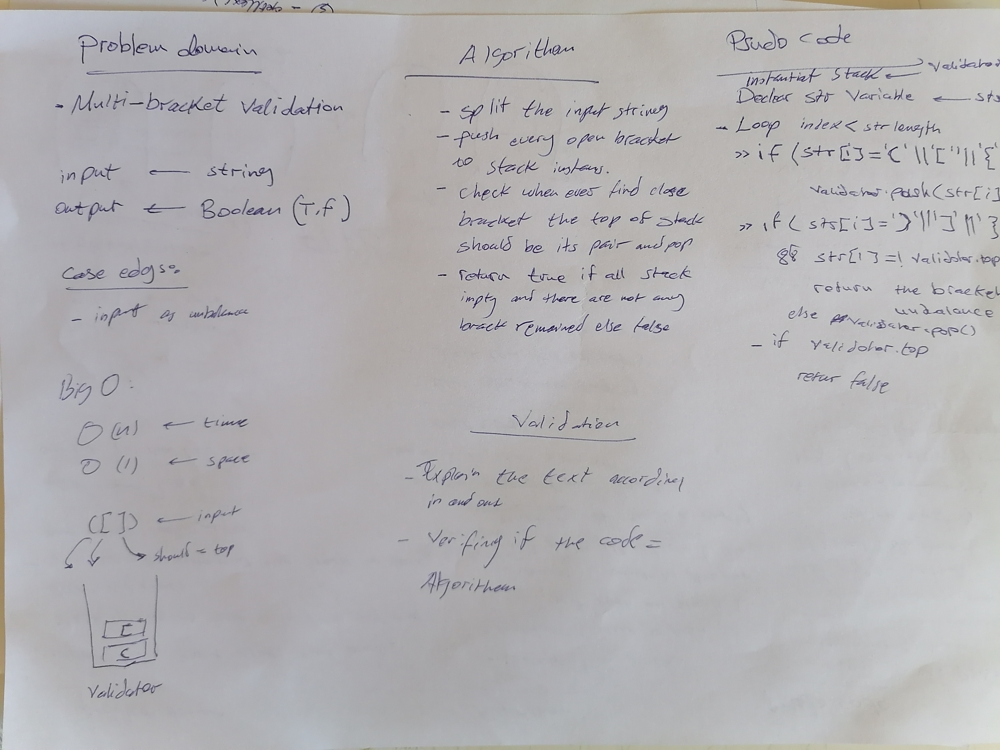

# Challenge Summary
Multi-bracket Validation. to check if the rackets are balance

## Challenge Description
function should take a string as its only argument, and should return a boolean representing whether or not the brackets in the string are balanced. There are 3 types of brackets:

Round Brackets : ()
Square Brackets : []
Curly Brackets : {}
## Approach & Efficiency
the output is boolean so the bigO for the space is 1 and for the time is depending on the n inputs 
## Solution
