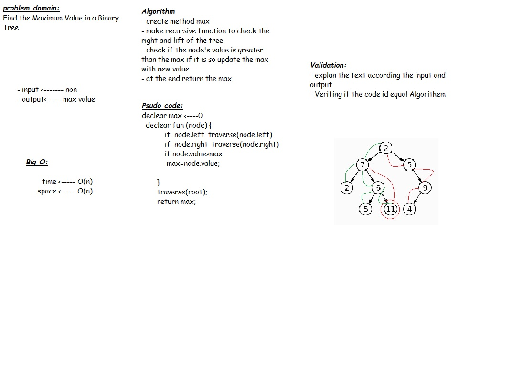

# Challenge Summary
Find the Maximum Value in a Binary Tree

## Challenge Description
Write an instance method called find-maximum-value. Without utilizing any of the built-in methods available to your language, return the maximum value stored in the tree. You can assume that the values stored in the Binary Tree will be numeric
## Approach & Efficiency
The big O for this max method will be O(n) for both time and space due to the method will traverse throgh the tree until find the value and it could be all value

## Solution
